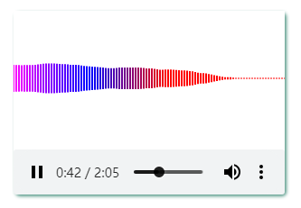
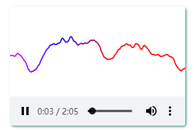

# [wave-audio](https://github.com/gitHber/wave-audio) &middot; [](./LICENSE)
[English](./README.md) | [中文简体](./README-zh.md)

## 简介

一个 React Audio 组件(可拖拽)，支持波状和柱状显示

### 柱状



### 波形



## 安装

> \$ npm install wave-audio

## 使用

```
import WaveAudio from 'wave-audio';
...
<WaveAudio src="demo.mp3" />
...
```

## 协议
wave-audio is [MIT Licensed](./LICENSE).
