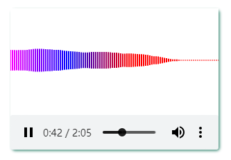
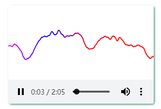

# [wave-audio](https://github.com/gitHber/wave-audio) &middot; [](./LICENSE)
[English](./README.md) | [中文简体](./README-zh.md)

## Introduce

A React Audio Component(can drag), support wave or bar to show

### bar



### wave



## Install

> \$ npm install wave-audio

## Useage

```
import WaveAudio from 'wave-audio';
...
<WaveAudio src="demo.mp3" />
...
```
## License
wave-audio is [MIT licensed](./LICENSE).
